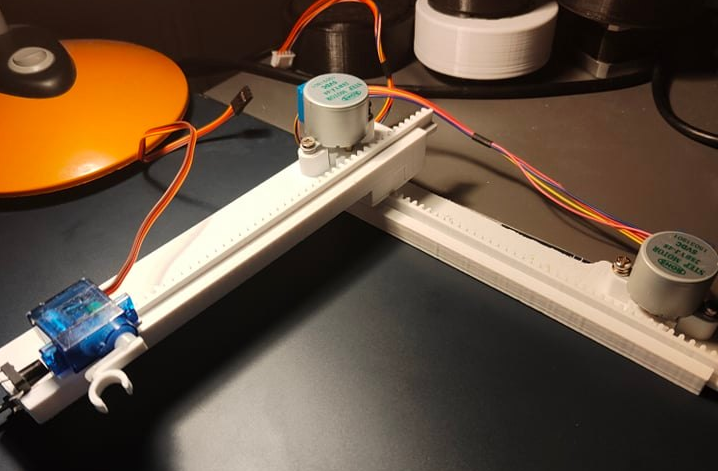
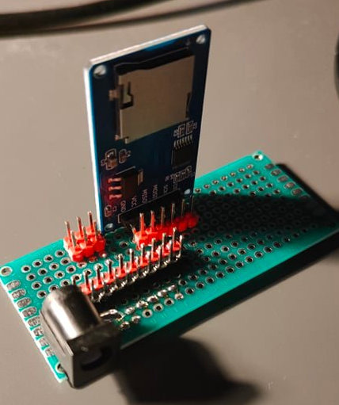
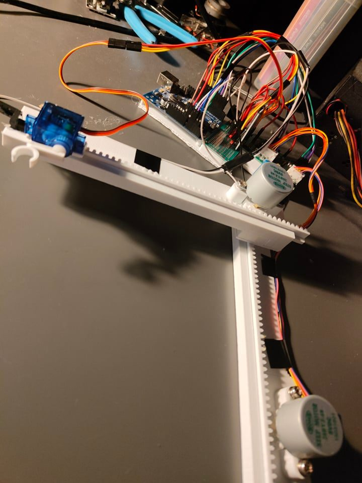

# Projekt 2Dplotter

## Opis

Projekt zaliczeniowy na przedmiot „Systemy mikroprocesorowe” (semestr 5).

Celem jest stworzenie urządzenia do rysowania na kartce, poruszającego się w dwóch osiach.

Obraz jest przetwarzany za pomocą niestandardowego profilu w slicerze Cura na plik G-code. Następnie G-code jest odczytywany z karty SD i interpretowany przez urządzenie.

Dwa silniki krokowe sterują pozycją rysika zgodnie z koordynatami zawartymi w G-code, a serwomechanizm dociska długopis do kartki, umożliwiając rysowanie.

---

## Obrazy

